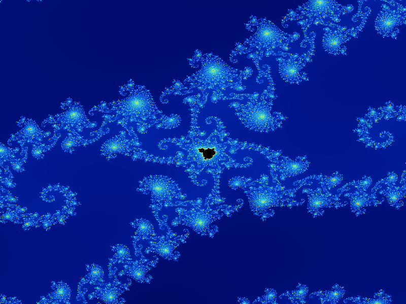

# Mandelbrot Set Viewer ∞

A Mandelbrot Set Viewer application, made in c++, that demonstrates a finitely** zooming fractal using the SFML (Simple and Fast Multimedia Library). This application continuously zooms into the Mandelbrot set, showcasing its intricate patterns and details.

**The Mandelbrot Viewer's visualization depends on the iterations. You'll need to play around with the MAX_ITER value to get less/more visualization. Beware of slow compute times.

## Features

- Continuous zooming Mandelbrot fractal visualization.
- Smooth animation with adjustable zoom speed.
- Multi-threaded rendering for improved performance and responsiveness.

## Screenshots




## Prerequisites

- **SFML**: A multimedia library for handling graphics, window management, and input.
  - Download SFML from [SFML's official website](https://www.sfml-dev.org/download.php).
- **Visual C++ Redistributable for Visual Studio**: Required to run applications built with Visual Studio.
  - Download from [Microsoft's website](https://support.microsoft.com/en-us/help/2977003/the-latest-supported-visual-c-downloads).

## Building the Project

### Using Visual Studio

1. **Clone the Repository**:
   ```bash
   git clone https://github.com/magicamagica/mandelbrotviewer.git
   ```

2. **Create A New Project**:
   - Create a project in Visual Studio, then use the code from the [main.cpp](main.cpp) file.

3. **Configure SFML**:
   - Go to `Project` -> `Properties`.
   - Under `VC++ Directories`, add the path to SFML's `include` directory in `Include Directories` and `SFML`'s `lib` directory in `Library Directories`.
   - Under `Linker` -> `Input`, add the SFML libraries (e.g., `sfml-graphics.lib`, `sfml-window.lib`, `sfml-system.lib`) to `Additional Dependencies`.
   - Copy the required SFML DLLs from SFML's `bin` directory to your project's output directory (`Release` or `Debug`).

4. **Build the Project**:
   - Select `Release` configuration from the `Configuration Manager`.
   - Go to `Build` -> `Build Solution` or press `Ctrl+Shift+B`.

### Running the Application

1. **Navigate to the Output Directory**:
   - Locate the `Release` folder within your project directory.

2. **Run the Executable**:
   - Double-click to start the application.

## Dependencies

The application requires the following SFML DLLs:
- `sfml-graphics-2.dll`
- `sfml-window-2.dll`
- `sfml-system-2.dll`

Additional runtime DLLs may be required:
- `vcruntime140.dll`
- `msvcp140.dll`

These DLLs are included in the `Release` ZIP file attached to this repository.

## Distribution

1. **Download the ZIP File**:
   - Navigate to the [Releases](https://github.com/magicamagica/mandelbrotviewer/releases) section of this repository.

2. **Extract the ZIP File**:
   - Extract the contents to a folder on your machine.

3. **Run the Application**:
   - Open the folder and double-click `mandelbrot.exe`.

## Contributing

Contributions are welcome! If you have suggestions, improvements, or bug fixes, please create a pull request or open an issue.

## Contact

- **Author**: Dimitris S.
- **GitHub**: [magicamagica](https://github.com/magicamagica)

## License

This project is licensed under the MIT License. See the [LICENSE](LICENSE) file for details.

## Acknowledgments

- [SFML](https://www.sfml-dev.org/) for the multimedia library.
- [Fractal algorithms](https://en.wikipedia.org/wiki/Mandelbrot_set) for inspiration.

---

_"Hold infinity in the palm of your hand"_ - *William Blake*
